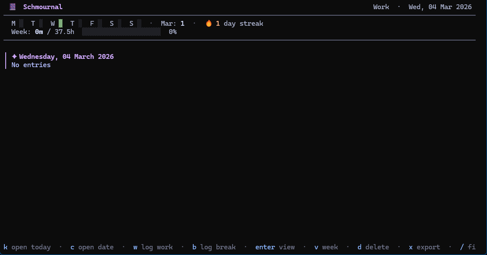
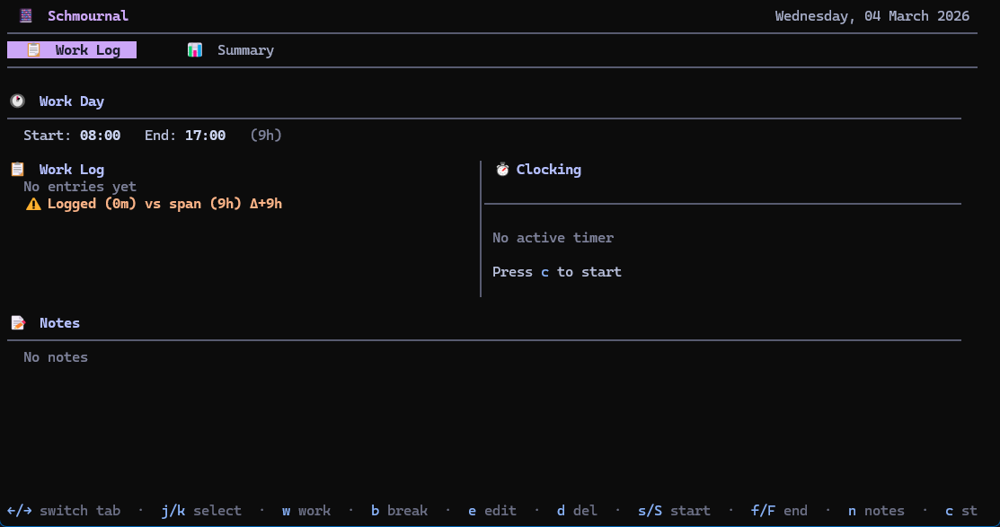
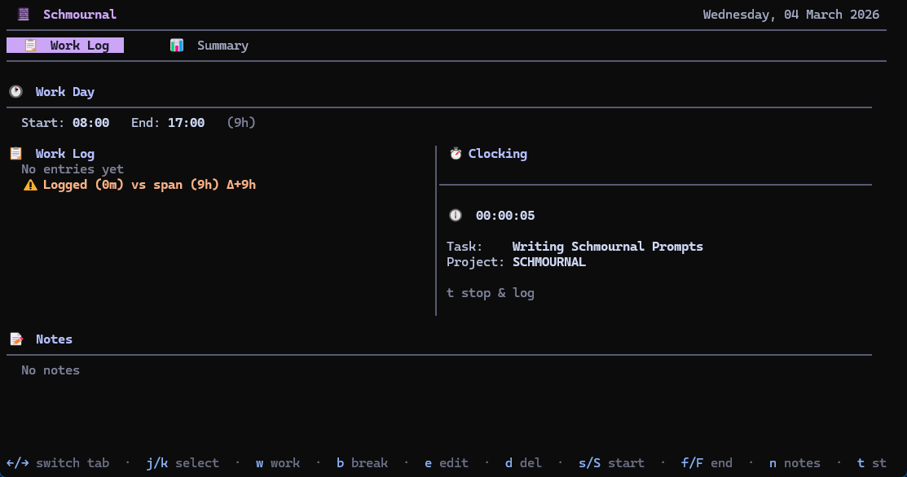
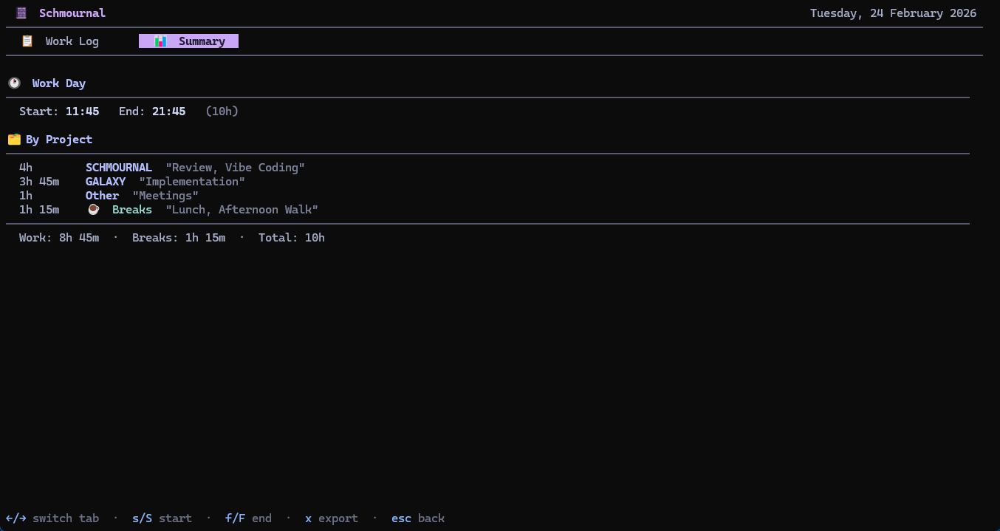
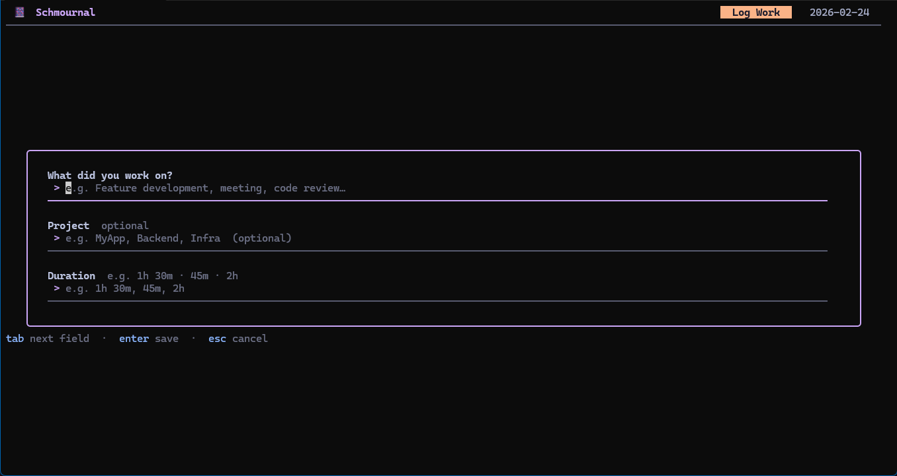
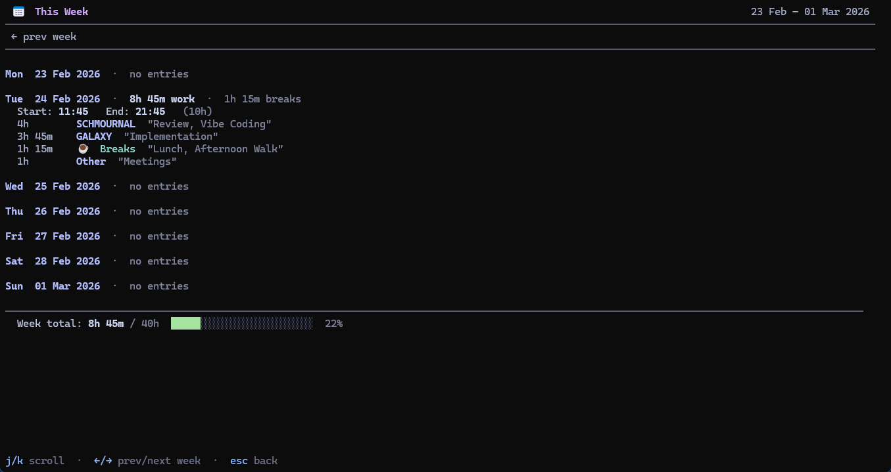
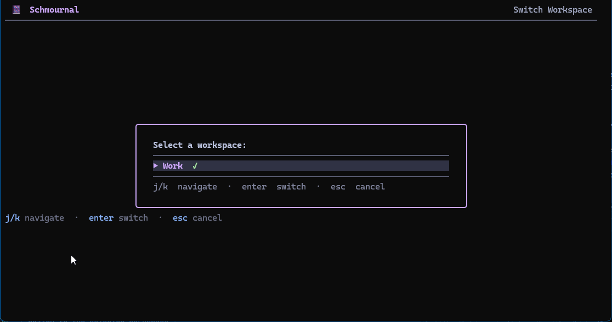

# 📔 Schmournal

> A minimal, distraction-free **terminal work journal** built with Go and the [Charm](https://charm.sh) TUI stack, themed with **Catppuccin Mocha**.

[](LICENSE)
[](go.mod)

<!-- PLACEHOLDER: Add a hero GIF or banner screenshot here -->
<!-- Suggested: a short terminal recording showing list → day view → stats -->
<!--  -->



---

## ✨ Features

- **List view** — all journal days sorted newest-first with an entry count and total work-time preview
- **Stats overview** — four-tab analytics screen with streak tracking, activity heatmap, and per-project breakdowns (monthly, yearly, all-time)
- **Week view** — weekly summary showing daily hours, breaks, and entry counts against your hours goal
- **Day view** — two-tab view: *Work Log* (entry table + live clock panel) and *Summary* (start/end times, totals, notes)
- **Work entry logging** — log tasks with an optional project, a duration, and free-form notes
- **Break logging** — track breaks separately so your summaries stay accurate
- **Multi-project split** — enter comma-separated projects on any entry to split the duration evenly across all of them automatically
- **Clock / timer** — start a live in-terminal stopwatch; elapsed time is rounded to the nearest minute and saved automatically when stopped
- **Workspace TODOs** — one global, hierarchical TODO list per workspace with subtasks, indentation, and completion toggling
- **Workspaces** — maintain entirely separate journal directories (e.g. personal vs. work) and switch between them instantly
- **Daily export** — generate a formatted Markdown report grouped by project with per-project subtotals
- **Open any day** — open or create a journal entry for any past or future date
- **Fuzzy filter** — quickly search your entry list with `/`
- **Delete with confirmation** — remove individual entries or entire day records safely
- **Fully configurable keybinds** — every shortcut can be remapped in the config file
- **Module toggles** — disable the clock or TODO panel entirely if you don't need them

---

## 📸 Screenshots

### List view


### Day view — Work Log tab



### Day view — Work Log with running clock



### Day view — Summary tab



### Work entry form



### Week view



### Workspace picker



<!-- PLACEHOLDER: Stats view — Overview tab (streaks + heatmap) -->
<!--  -->

<!-- PLACEHOLDER: Stats view — Monthly tab (project bar chart) -->
<!--  -->

<!-- PLACEHOLDER: TODO panel open in Day view -->
<!--  -->

<!-- PLACEHOLDER: Notes editor (full-screen textarea) -->
<!--  -->

---

## 🚀 Installation

### Homebrew (macOS / Linux) — recommended

```bash
brew install SleepyPxnda/schmournal/schmournal
```

Or tap first so you can keep it up to date with `brew upgrade`:

```bash
brew tap SleepyPxnda/schmournal https://github.com/SleepyPxnda/schmournal
brew install schmournal
brew upgrade schmournal   # update to the latest release at any time
```

> **Note:** The formula is automatically updated on every release.

---

### Debian / Ubuntu — `.deb` package

Pre-built `.deb` packages for **amd64** and **arm64** are published on every
[GitHub release](https://github.com/SleepyPxnda/schmournal/releases).

```bash
# Replace <version> and <arch> (amd64 or arm64) with the values you want
curl -LO https://github.com/SleepyPxnda/schmournal/releases/download/v<version>/schmournal_<version>_<arch>.deb
sudo dpkg -i schmournal_<version>_<arch>.deb
```

Example for release `v2.1` on an `amd64` machine:

```bash
curl -LO https://github.com/SleepyPxnda/schmournal/releases/download/v2.1/schmournal_2.1_amd64.deb
sudo dpkg -i schmournal_2.1_amd64.deb
```

---

### Build from source

Requires **Go 1.21+**.

```bash
git clone https://github.com/SleepyPxnda/schmournal.git
cd schmournal

# Build for your current platform
go build -o schmournal .
./schmournal
```

Cross-compile for all platforms using the bundled Makefile:

```bash
make build            # all platforms (macOS, Linux, Windows)
make build-mac        # macOS arm64 + amd64
make build-linux      # Linux amd64 + arm64
make build-windows    # Windows amd64 + arm64
make clean            # remove the dist/ directory
```

Binaries are written to `dist/` (e.g. `dist/schmournal-linux-amd64`).

---

## ⚡ Quick start

```bash
schmournal            # open the list view
schmournal --version  # print the installed version
```

On first run, a default config is written to `~/.config/schmournal.config`.
Journal files are stored in `~/.journal/` by default.

---

## 🗂 Views & navigation

### 📋 List view

The main screen. Shows every day that has a journal entry, newest first, with a count of work items and total tracked time for each day. Use `/` to filter the list by date.

| Key | Action |
|-----|--------|
| `n` | Open today's entry (creates it if it doesn't exist) |
| `c` | Open or create an entry for any specific date |
| `enter` | Open the selected day |
| `d` | Delete the selected day (with confirmation) |
| `x` | Export the selected day's work log to Markdown |
| `v` | Open the **week view** |
| `s` | Open the **stats view** |
| `p` | Open the **workspace picker** (when workspaces are configured) |
| `/` | Fuzzy-filter the entry list |
| `q` / `esc` | Quit |

---

### 👁 Day view

Opens when you select a day. Has two tabs — switch between them with `←` / `→`.

#### Work Log tab

Shows the **start/end time bar**, a table of all work and break entries, and a summary line with work, break, and total time. On terminals 60+ columns wide, a **clock panel** is displayed on the right (showing the live elapsed timer when the clock is running).


| Key | Action |
|-----|--------|
| `←` / `→` | Switch between Work Log and Summary tabs |
| `j` / `↓` | Select the next entry |
| `k` / `↑` | Select the previous entry |
| `w` | Log a new work item |
| `b` | Log a new break |
| `e` | Edit the selected entry (opens notes editor if no entry is selected) |
| `d` | Delete the selected entry (or the whole day if none is selected) |
| `s` | Stamp current time as **Start** |
| `S` | Open dialog to manually **set Start time** |
| `f` | Stamp current time as **End** (finish) |
| `F` | Open dialog to manually **set End time** |
| `n` | Open the notes editor |
| `c` | **Start** the clock timer (or **stop** it and save the entry if the clock is running) |
| `t` | Toggle TODO panel focus |
| `x` | Export this day's work log |
| `esc` | Back to list view |

#### Summary tab

Shows a compact overview: start time, end time, day duration, total work, total breaks, and your free-form notes.


| Key | Action |
|-----|--------|
| `←` / `→` | Switch tabs |
| `s` / `S` | Set start time (now or manual) |
| `f` / `F` | Set end time (now or manual) |
| `x` | Export this day |
| `esc` | Back to list view |

---

### 📊 Stats view

Four-tab analytics screen. Navigate tabs with `←` / `→`, scroll content with `j` / `k`, and press `q` or `esc` to return to the list.

<!-- PLACEHOLDER: Stats overview screenshot -->
<!--  -->

| Tab | Contents |
|-----|----------|
| **Overview** | 🔥 Current & longest streak · total days logged · 16-week activity heatmap |
| **Monthly** | Total hours this month · days logged · project breakdown with bar chart |
| **Yearly** | Total hours this year · month-by-month bar chart · top projects |
| **All-time** | Total hours ever · all-time top projects ranked by time |

**Heatmap legend** (Overview tab):
- `▓` — day with logged entries
- `░` — working day without entries
- Grayed out block — non-working day (weekend or custom `work_days`)
- Faded block — future date

**Project bar charts** show duration, a relative bar, and the percentage of total work time. Entries without a project are grouped under *Other*.

| Key | Action |
|-----|--------|
| `←` / `→` | Previous / next tab |
| `j` / `k` | Scroll content |
| `q` / `esc` | Back to list view |

---

### 📅 Week view

Shows a summary for the selected week (Monday–Sunday): daily hours, breaks, and entry counts. A progress bar compares the week total against your `weekly_hours_goal`.


| Key | Action |
|-----|--------|
| `←` | Previous week |
| `→` | Next week (only available when viewing a past week) |
| `j` / `k` | Scroll content |
| `q` / `esc` | Back to list view |

---

### 🗂 Workspace picker

Keeps entirely separate journal directories — useful for personal vs. work journaling. When two or more workspaces are configured, a workspace indicator appears in the list view header.


Press `p` from the **list view** to open the picker.

| Key | Action |
|-----|--------|
| `j` / `↓` | Move selection down |
| `k` / `↑` | Move selection up |
| `enter` | Switch to the selected workspace |
| `esc` | Cancel |

---

## ✅ TODO panel

Each workspace has a single, persistent TODO list visible alongside the Work Log tab. Todos can be nested (subtasks), indented, reordered, and completed. Completed todos are harvested and saved with the day's record when you leave the day view.

<!-- PLACEHOLDER: TODO panel screenshot -->
<!--  -->

Focus must be on the TODO panel (press `t` to toggle). When the TODO panel is focused:

| Key | Action |
|-----|--------|
| `j` / `↓` | Move selection down |
| `k` / `↑` | Move selection up |
| `a` | Start inline TODO input (add new todo) |
| `A` | Add a subtodo under the selected todo |
| `enter` | Toggle inline input / save current inline draft |
| `tab` | Indent the selected todo (make it a subtask) |
| `shift+tab` | Outdent the selected todo |
| `space` | Toggle the selected todo's completed state |
| `delete` / `backspace` | Delete the selected todo |
| `t` | Return focus to Work Log entries |

---

## ⏱ Clock / timer

Track time against a task in real time without estimating duration up front.

1. From the **Work Log tab**, press `c` to open the **Start Clock** form — enter a task name and an optional project (comma-separated for multi-project splits).
2. Press `enter` to start the timer. A live clock panel appears on the right side of the Work Log tab, updating every second.
3. Press `c` again at any time to **stop** the timer. The elapsed duration is rounded to the nearest minute and saved as a new work entry automatically. If multiple projects were entered the duration is split evenly.


---

## 📝 Work / break log form


Work items have **three fields**: Task · Project (optional) · Duration.  
Break items have **two fields**: Label · Duration.

| Key | Action |
|-----|--------|
| `tab` / `shift+tab` | Move to next / previous field |
| `enter` | Advance to next field, or **submit** on the last field |
| `esc` | Cancel |

**Multi-project split:** Enter a comma-separated list of projects (e.g. `Frontend, Backend`) and the logged duration is split evenly across all of them, creating one entry per project.

**Duration formats** — all of these are valid:

| Input | Meaning |
|-------|---------|
| `1h 30m` | 1 hour 30 minutes |
| `45m` | 45 minutes |
| `2h` | 2 hours |
| `1.5h` | 1 hour 30 minutes |
| `90` | 90 minutes (bare number = minutes) |

---

## ⏰ Time input dialog

Used when pressing `S` (set start manually) or `F` (set end manually).

| Key | Action |
|-----|--------|
| `enter` | Confirm |
| `r` | Reset / clear the current value |
| `esc` | Cancel |

Input format: `HH:MM` (24-hour, e.g. `09:00`, `14:30`)

---

## 📆 Date input dialog

Used when pressing `c` from the list view to open a specific date.

| Key | Action |
|-----|--------|
| `enter` | Open or create the day |
| `esc` | Cancel |

Input format: `YYYY-MM-DD`

---

## 📄 Notes editor

Full-screen textarea attached to each day. Open it with `n` from the day view or by pressing `e` with no entry selected.

<!-- PLACEHOLDER: Notes editor screenshot -->
<!--  -->

| Key | Action |
|-----|--------|
| `ctrl+s` | Save |
| `esc` | Cancel (discard unsaved changes) |

---

## 🗑 Delete confirmation

Whenever you delete an entry or an entire day record a confirmation prompt appears.

| Key | Action |
|-----|--------|
| `y` / `Y` | Confirm deletion |
| `n` / `N` / `esc` | Cancel |

---

## 📤 Export

Press `x` (from the list view or day view) to generate a Markdown report:

```
~/.journal/exports/export-YYYY-MM-DD.md
```

The report contains:

- **🕐 Work Day** — start time, end time, total day duration
- **📋 Work Items** — grouped by project; same-named tasks within a project are consolidated; per-project subtotals
- **☕ Breaks** — consolidated break list with a total
- **📊 Summary** — work time, break time, total logged, day duration

---

## ⚙️ Configuration

Schmournal is configured via `~/.config/schmournal.config` (TOML). The file is created automatically with defaults on first run.

### Full reference

```toml
# ── Storage ───────────────────────────────────────────────────────────────────

# Root directory where daily JSON files are stored.
# Supports ~ expansion. Default: "~/.journal"
storage_path = "~/.journal"

# ── Goals & Schedule ──────────────────────────────────────────────────────────

# Weekly working-hours target used in the stats bar progress meter.
# Default: 40
weekly_hours_goal = 40

# Days of the week treated as working days.
# Only these days are counted for streak calculation and the heatmap.
# Accepted values (case-insensitive): "monday" … "sunday"
# Default: ["monday","tuesday","wednesday","thursday","friday"]
work_days = ["monday", "tuesday", "wednesday", "thursday", "friday"]

# ── Modules ───────────────────────────────────────────────────────────────────

[modules]
# Enable / disable the clock timer feature.  Default: true
clock_enabled = true

# Enable / disable the TODO panel.  Default: true
todo_enabled = true

# ── Workspaces ────────────────────────────────────────────────────────────────
# Define multiple independent journal directories.
# Omitted per-workspace fields fall back to the top-level defaults.
# Workspace names must be unique and have no leading/trailing whitespace.

[[workspaces]]
name              = "Personal"
storage_path      = "~/.journal/personal"
weekly_hours_goal = 40
work_days         = ["monday", "tuesday", "wednesday", "thursday", "friday"]

[[workspaces]]
name              = "Work"
storage_path      = "~/.journal/work"
weekly_hours_goal = 37.5

# ── Keybinds ──────────────────────────────────────────────────────────────────
# Single-character strings only. Arrow keys, Enter, Esc, and Tab always keep
# their built-in roles and cannot be rebound.
# Duplicate binds within the same view context are not allowed.

[keybinds.list]
quit             = "q"   # Quit the application
open_today       = "n"   # Open / create today's entry
open_date        = "c"   # Open / create an entry for a specific date
delete           = "d"   # Delete the selected day record
export           = "x"   # Export the selected day to Markdown
week_view        = "v"   # Open the week view
stats_view       = "s"   # Open the stats overview
switch_workspace = "p"   # Open the workspace picker

[keybinds.day]
add_work         = "w"   # Add a new work entry
add_break        = "b"   # Add a new break entry
edit             = "e"   # Edit selected entry (or open notes when none selected)
delete           = "d"   # Delete selected entry (or the whole day when none selected)
set_start_now    = "s"   # Stamp current time as start
set_start_manual = "S"   # Open dialog to set start time manually
set_end_now      = "f"   # Stamp current time as end
set_end_manual   = "F"   # Open dialog to set end time manually
notes            = "n"   # Open the notes editor
todo_overview    = "t"   # Toggle TODO panel focus
export           = "x"   # Export this day's work log
clock_start      = "c"   # Start the clock timer
clock_stop       = "c"   # Stop the clock and save the entry (same key as clock_start by default)
                         # When a clock is already running, pressing this key stops it;
                         # when no clock is running, it starts one.
                         # You can bind these to different keys if you prefer explicit start/stop.
```

### Per-workspace overrides

Each `[[workspaces]]` block can override `storage_path`, `weekly_hours_goal`, and `work_days`. Any field not set falls back to the top-level value. Each workspace also maintains its own `todos.json` file at the workspace storage root.

| Field | Effect |
|-------|--------|
| `storage_path` | Override the directory for this workspace's journal files |
| `weekly_hours_goal` | Override the hours target for the stats/week view progress bar |
| `work_days` | Override which days are treated as working days for streaks and the heatmap |

### Module toggles

| Setting | Default | Effect when `false` |
|---------|---------|---------------------|
| `modules.clock_enabled` | `true` | Hides the clock panel and disables the `clock_start` / `clock_stop` keybinds |
| `modules.todo_enabled` | `true` | Hides the TODO panel and disables the `todo_overview` keybind |

---

## 🗃 Storage layout

```
~/.config/schmournal.config   ← app configuration (TOML)

~/.journal/                   ← default storage root
├── 2024-01-15.json           ← one file per logged day
├── 2024-01-16.json
├── todos.json                ← active workspace TODOs
└── exports/
    └── export-2024-01-15.md  ← generated Markdown exports
```

When multiple workspaces are configured each workspace has its own directory with the same layout.

---

## 🎨 Theme

Schmournal uses the **[Catppuccin Mocha](https://github.com/catppuccin/catppuccin)** colour palette throughout:

| Role | Colour |
|------|--------|
| Primary accent | Mauve |
| Highlights | Lavender |
| Backgrounds | Base / Surface / Overlay |
| Text | Text / Subtext |

The palette provides a consistent, easy-on-the-eyes dark-mode experience in any true-colour terminal.
